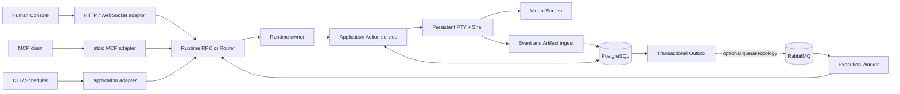

# iTerminal

[English](./README.md) | [简体中文](./README_zh_CN.md)

> **One shell. Many minds. Every action accounted for.**

```text
                 ┌──────────────────────────────────────┐
 Human ─────────▶│                                      │
 Agent ─────────▶│  ACTION RUNTIME  ·  EVENT TIMELINE  │─────────┐
 Scheduler ─────▶│                                      │         ▼
                 └──────────────────────────────────────┘   ┌────────────┐
                                                          │ REAL PTY   │
                                                          │ REAL SHELL │
                                                          └─────┬──────┘
                                                                ▼
                                                   one changing environment
```

iTerminal is a local-first shared terminal runtime for Humans, Agents, and Schedulers. Every actor
works through the same persistent Shell and sees the effects of everyone else's work: the same
`cwd`, exported environment, foreground process, REPL, terminal screen, and canonical geometry.

It is not a stateless command runner, a screen-sharing wrapper, or an “Agent drives, Human takes
over” terminal. It treats the live terminal as a coordinated operating-system resource with
explicit actions, durable facts, bounded observation, and conservative failure semantics.

## The core contract

```text
Session generation N
  └── one persistent PTY
       └── one persistent Shell
            └── zero or one foreground Execution
```

- Shell mutations such as `cd`, `export`, `source`, and `nvm use` happen in the real top-level
  Shell and remain visible to every actor.
- Execute, Input, Human-only SecretInput, Control, and Resize are immutable, attributable Actions.
- A Session accepts at most one active ExecuteAction. Contention fails fast with `PTY_BUSY` instead
  of creating a hidden second Shell.
- Input and Control target an exact Execution and generation. Stale writes are rejected.
- Human output is live and high-bandwidth; Agent observation is bounded, versioned, and
  addressable.
- An uncertain external side effect becomes `UNKNOWN`. It is never blindly replayed.
- A lost PTY becomes `BROKEN`. Rebuild and fork create a new PTY from a limited Shell Checkpoint;
  they never pretend to migrate or resurrect a process tree.

## Why it is different

Most terminal integrations optimize for issuing commands. iTerminal optimizes for safely sharing
one stateful terminal between independent actors.

| Concern      | iTerminal's choice                                                                        |
| ------------ | ----------------------------------------------------------------------------------------- |
| Shared state | One real persistent Shell per Session generation                                          |
| Actors       | Human, Agent, Scheduler, and System are first-class identities with explicit capabilities |
| Coordination | Structured Actions, versioned interaction policy, and short Human Interaction Guards      |
| Contention   | Fail fast on one busy Session; fork a new Session when parallel work is intentional       |
| Freshness    | Check generation, target Execution, expected version, screen version, and Session fence   |
| Observation  | Combine an append-only Event timeline with one bounded, versioned Virtual Screen          |
| Recovery     | Preserve `BROKEN`/`UNKNOWN` evidence and require explicit rebuild into a new PTY          |
| Reliability  | PostgreSQL is durable truth; RabbitMQ is an at-least-once wake-up plane, not truth        |

The result is a terminal collaboration model in which no adapter owns a private execution path and
no viewer silently changes the PTY for everyone else.

## Architecture



| Layer                | Responsibility                                                                                           |
| -------------------- | -------------------------------------------------------------------------------------------------------- |
| Human Console        | Loopback-only React + xterm.js interface with live output, Timeline, approvals, and guarded interaction  |
| MCP adapter          | Bounded Agent tools over stdio; its lifecycle never owns the PTY                                         |
| Runtime RPC / Router | Authenticates scoped grants and either reaches one Runtime directly or resolves the durable owner route  |
| Runtime owner        | Owns the live PTY, Shell integration channel, Virtual Screen, and application state machine              |
| PostgreSQL           | Stores accepted and observed facts, identities, leases, fences, checkpoints, cursors, and delivery state |
| Messaging            | Relays committed Outbox work through RabbitMQ and deduplicates consumers with an Inbox                   |
| Process Guardian     | Reclaims the registered local PTY process tree if a durable Runtime becomes unreachable                  |

The default local path deliberately uses one PostgreSQL-backed Runtime with immediate dispatch. The
same contracts also support an explicit Router, multiple Runtime owners, RabbitMQ relay, and
Execution Workers without making the queue or Router the owner of terminal truth.

## Product highlights

### One changing environment

Humans and Agents collaborate inside the same real Shell rather than exchanging isolated command
results. Stateful workflows—REPLs, editors, pagers, foreground jobs, environment setup, and job
control—remain part of the shared context.

### Actions, Executions, and observations stay separate

An Action is what an Actor requested. An Execution is the observed attempt to run an ExecuteAction.
Events, Artifacts, and the Virtual Screen are observations. Keeping these facts separate avoids
turning “request accepted,” “bytes written,” “output observed,” and “program completed” into one
misleading success flag.

### Human bandwidth without unbounded Agent context

The browser receives a live terminal stream. Agents use bounded screen reads, regions, diffs,
searches, waits, styled cells, terminal-state evidence, and durable Event cursors. Missing screen
history or expired Event history requires explicit resynchronization rather than returning a
plausible partial answer.

### Collaboration without terminal ownership

Versioned Input Policy and short Human Interaction Guards coordinate semantically sensitive input.
They do not create a long-lived “interactive mode” owner. Canonical rows and columns belong to the
Runtime, so one viewer cannot resize only its private interpretation of the terminal.

### Conservative recovery

Runtime identity, owner epochs, Session leases, monotonic fencing tokens, and independent Execution
versions reject stale mutations. Database loss breaks the affected owner until its live state is
reconciled. A Runtime or Router crash cannot justify replaying a write whose Shell effect is
uncertain.

### Explicit scale topology

For larger local deployments, durable root-creation intent, atomic placement claims,
capacity-weighted routing, database-time rate limits, graceful drain, and owner-local dispatch allow
multiple Runtime processes without claiming live PTY migration or exactly-once side effects.

### Bounded durable history

PTY output coalescing, Artifact budgets, cursor-safe Event retention, dependency-aware fact cleanup,
and database-capacity signals prevent “append-only” from quietly becoming “unbounded forever.”

## Security model

iTerminal uses conjunctive authorization: Actor capability, Actor role, interaction policy or Guard,
operation-scoped Runtime RPC grant, and—where configured—Human Approval must all agree.

- Runtime RPC grants are signed, expiring, operation-scoped, and bound to an exact Actor or Actor
  prefix.
- Agent Execute can require a durable, one-time Human Approval bound to the exact proposed Action.
- SecretInput is Human-only. Secret bytes are transient, ordinary input is blocked during the
  sensitive period, and Runtime output is fail-closed redacted before persistence and observation.
- The Human Console binds to one exact loopback authority and bounds HTTP, WebSocket, request-frame,
  path, and Shell-integration resources.
- Operational errors and connection diagnostics do not echo grants or database/broker credentials.

This is a local coordination and accountability boundary, not an OS sandbox. It does not protect
against hostile code running as the same operating-system user, provide remote multi-user
authentication, prevent swap/core exposure, or turn Shell commands into safe code.

## Reliability model

PostgreSQL records durable intent and observed facts before or alongside live work. A Transactional
Outbox, publisher confirms, RabbitMQ delivery, Consumer Inbox, leases, and durable rechecks compose
an at-least-once wake-up path. They do **not** make PTY writes exactly once.

The Runtime therefore preserves ambiguity instead of hiding it:

- accepted Action does not imply started Execution;
- attempted delivery does not imply the foreground program consumed the input;
- broker acknowledgement does not prove a Shell side effect;
- stale ownership is fenced, but already-issued external side effects cannot be undone;
- process loss produces durable `BROKEN` and, where necessary, `UNKNOWN` evidence.

## Run the durable local path

Prerequisites are Node.js 22+, pnpm 10, zsh on macOS or Linux, and Docker with Compose unless an
external writable PostgreSQL primary is supplied.

```sh
pnpm install
pnpm local
```

Open the exact `consoleUrl` from the final `iterminal.local.ready` JSON line. Use **Connect MCP** in
the Console toolbar to open the contextual side panel and copy the complete `mcpServers` JSON; no
config-file lookup is needed. The terminal stays full width until a tool is opened, while pending
Agent approvals and broken-Session recovery open their relevant panel automatically. Treat the
copied configuration as credential material. Press Ctrl+C once to drain the Runtime and stop the
managed stack while preserving its PostgreSQL volume.

See the [local durable quickstart](./docs/operations/local-quickstart.md) for external PostgreSQL,
configuration, shutdown, recovery, and the deliberate single-Runtime boundary.

## Deployment shapes

| Shape                  | Best for                                            | Composition                                                                |
| ---------------------- | --------------------------------------------------- | -------------------------------------------------------------------------- |
| Local quickstart       | Evaluation and ordinary local development           | PostgreSQL + one Runtime + Human Console + generated MCP configuration     |
| Direct durable Runtime | Protocol and component work                         | Explicit grants and adapters connected to one Runtime Unix socket          |
| Routed queue topology  | Ownership, placement, delivery, and failure testing | PostgreSQL + Router + multiple Runtime owners + RabbitMQ + relay + Workers |

These are local deployment shapes. Remote bind, TLS termination, distributed host fencing, and live
PTY migration are intentionally outside the current trust model.

## Documentation

- [Documentation index](./docs/README.md) — curated entry point for architecture, protocols,
  operations, decisions, and verification evidence.
- [Roadmap and acceptance gates](./TODO.md) — changing scope, remaining work, failure matrix, and
  Definition of Done.
- [Architecture Decision Records](./docs/adr/README.md) — the reasoning and consequences behind
  runtime contracts.
- [Canonical terminology](./docs/TERMINOLOGY.md) — protocol language and forbidden conflations.
- [Bounded observation](./docs/architecture/bounded-observation.md) — Event, cursor, search, and
  Artifact boundaries.
- [PostgreSQL transaction boundary](./docs/architecture/postgres-transaction-boundary.md) — where
  durable admission and live effects meet.
- [Shell integration channel](./docs/architecture/shell-integration-control-channel.md) — how the
  Runtime observes command boundaries without trusting visible terminal text.
- [MCP protocol](./docs/protocol/m4-mcp-tools.md), [Human Console protocol](./docs/protocol/m5-human-console.md),
  and [Runtime RPC authentication](./docs/protocol/m10-runtime-rpc-authentication.md) — adapter and
  authentication contracts.
- [Operations guides](./docs/operations/) — quickstart, retention, storage, capacity, and Console
  security.
- [Verification reports](./docs/verification/README.md) — environment-specific evidence, scenarios, and
  explicit limitations.
