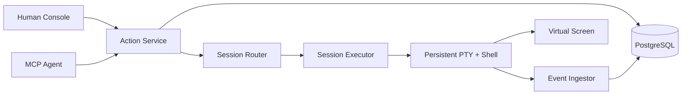

# iTerminal

> **One shell. Many minds. Every action accounted for.**

```text
                 ┌──────────────────────────────────────┐
 Human ─────────▶│                                      │
 Agent ─────────▶│  ACTION RUNTIME  ·  EVENT TIMELINE  │─────────┐
 Scheduler ─────▶│                                      │         │
                 └──────────────────────────────────────┘         ▼
                                                           ┌────────────┐
                                                           │ REAL PTY   │
                                                           │ REAL SHELL │
                                                           └─────┬──────┘
                                                                 ▼
                                                    one changing environment
```

iTerminal is a local-first terminal runtime where humans and agents are equal actors in the same persistent shell session. They share the same `cwd`, exported environment, foreground process, REPL, and terminal screen. Neither side gets a hidden bypass: execute, input, and control operations enter one structured Action Runtime and leave an attributable event trail.

This is not another stateless `exec()` wrapper, and it is not an “agent drives, human takes over” terminal. The hard problem here is coordination around a live, stateful operating-system resource.

## The contract

```text
Session generation N
  └── one persistent PTY
       └── one persistent Shell
            └── zero or one foreground Execution
```

- `cd`, `export`, `source`, `nvm use`, and similar mutations happen in the real top-level shell.
- One session accepts at most one active ExecuteAction. A competing execute fails fast with `PTY_BUSY`.
- Input and control target an exact execution generation; stale writes are rejected.
- Human output is live and high-bandwidth. Agent observation is bounded and addressable.
- An uncertain external side effect becomes `UNKNOWN`; it is never blindly replayed.
- A lost PTY cannot migrate or resurrect. Rebuild creates a new generation from a limited checkpoint.

## Why it is different

Most terminal tools optimize for command execution or remote administration. iTerminal focuses on the shared-runtime semantics between actors:

| Concern      | iTerminal choice                                                    |
| ------------ | ------------------------------------------------------------------- |
| Environment  | One real persistent shell per session generation                    |
| Coordination | Structured Execute, Input, and Control actions                      |
| Contention   | Fail fast with `PTY_BUSY`; fork a session for parallel work         |
| Freshness    | Session generation, target execution, and screen version checks     |
| Observation  | Append-only events plus a versioned virtual screen                  |
| Recovery     | Durable facts in PostgreSQL; live PTY loss becomes `BROKEN/UNKNOWN` |
| Reliability  | PostgreSQL Outbox + RabbitMQ wake-up + Inbox; no exactly-once claim |

## Current status

**M0–M4.1 and the M8.1 notification plane pass at L2: shared Shell, durable Action Runtime, real stdio MCP, and reliable Outbox/RabbitMQ/Inbox delivery.**

Real local bash and zsh PTY scenarios prove command boundaries, shared state, fail-fast Busy, structured Input/Control, stale-target rejection, marker-spoof isolation, large output, and Ctrl+C recovery. With `ITERM_DATABASE_URL`, the live daemon now commits Execute/Input/Control admission before PTY delivery, sends attributed output through a bounded per-Session ingest loop, serves durable cursors, and marks a `SIGKILL`-lost owner generation `BROKEN/UNKNOWN` on restart. An official MCP SDK Client drives the same live zsh across stdio bridge restarts; OpenCode and Claude Code handshakes also pass. In-memory development mode remains available, but no model-driven Agent has been authorized and the Human Console is not complete.

M8.1 adds a standalone leased Outbox relay, RabbitMQ publisher confirms, durable quorum main/retry/DLQ queues, manual ACK with bounded prefetch, canonical Consumer Inbox deduplication, and database revalidation of delayed `ExecutionReady` messages. It is an at-least-once notification plane: actual PTY dispatch remains inside the owner-local M4.1 daemon until M8.2 proves the write crash matrix.

See:

- [TODO.md](./TODO.md) — full roadmap, acceptance gates, failure matrix, and Definition of Done.
- [Architecture decisions](./docs/adr/README.md) — why the runtime uses these semantics.
- [Terminology](./docs/TERMINOLOGY.md) — canonical domain language.
- [M0 spike](./spikes/shell-integration/README.md) — the highest-risk hypothesis and its evidence.
- [M0 verification](./docs/verification/M0/2026-08-30-shell-integration.md) — environment, scenarios, limits, and L2 boundary.
- [M1 verification](./docs/verification/M1/2026-08-30-runtime-cli.md) — Runtime/CLI scenarios and remaining durability boundary.
- [M2 verification](./docs/verification/M2/2026-08-30-postgres-persistence.md) — real PostgreSQL concurrency, rollback, and recovery evidence.
- [M3 observation architecture](./docs/architecture/bounded-observation.md) — query, cursor, search, and artifact bounds.
- [M3 verification](./docs/verification/M3/2026-08-30-bounded-observation.md) — real PostgreSQL 100k-line and slow-consumer evidence.
- [M4 daemon/MCP decision](./docs/adr/0007-runtime-daemon-mcp-bridge.md) — why Client lifecycle cannot own the PTY.
- [M4 MCP protocol](./docs/protocol/m4-mcp-tools.md) — tools, Actor binding, results, and errors.
- [M4 verification](./docs/verification/M4/2026-08-30-mcp-adapter.md) — official SDK, OpenCode, Claude Code, and remaining L3 boundary.
- [M4.1 durability decision](./docs/adr/0008-live-runtime-durable-journal.md) — live PTY truth, write-ahead facts, and the bounded ingest loop.
- [M4.1 verification](./docs/verification/M4/2026-08-30-durable-runtime.md) — real PostgreSQL/MCP Actions and daemon crash recovery.
- [M8.1 messaging decision](./docs/adr/0009-outbox-rabbitmq-inbox.md) — why confirms, ACKs, Inbox leases, and DB rechecks are separate boundaries.
- [M8.1 verification](./docs/verification/M8/2026-08-30-reliable-messaging.md) — real PostgreSQL/RabbitMQ duplicate, retry, DLQ, and relay lifecycle evidence.

## Planned shape



The codebase will remain a modular monolith until the runtime semantics are proven. RabbitMQ and multi-worker ownership appear only after durable state, crash semantics, and owner routing have evidence.

## Development

Prerequisites:

- Node.js 22 or newer
- pnpm 10
- macOS or Linux for the PTY spike
- bash and/or zsh

After dependencies are installed:

```bash
pnpm verify
pnpm cli
ITERM_RUNTIME_SOCKET=/tmp/iterminal.sock pnpm daemon
ITERM_RUNTIME_SOCKET=/tmp/iterminal.sock pnpm mcp
ITERM_DATABASE_URL=postgresql://... ITERM_RABBITMQ_URL=amqp://... pnpm outbox-relay
pnpm spike:shell -- --shell zsh
pnpm spike:shell -- --shell bash
```

The command above starts explicit in-memory development mode. To enable the durable journal, start PostgreSQL and pass `ITERM_DATABASE_URL` to `pnpm daemon`; the MCP bridge still receives only `ITERM_RUNTIME_SOCKET`. PostgreSQL durability does not sandbox Shell commands or resurrect a lost PTY.

The repository does not yet have a final license. That decision is intentionally tracked in the roadmap instead of being silently assumed.

## Honesty over theatre

The README is dramatic. The completion claims are not.

Every milestone uses L0–L4 evidence levels. A green build is not a shared-terminal scenario. A mock client is not a real MCP Agent. A database row is not proof that a shell command ran. The project is complete only when the real Human/Agent path and its failure modes have been exercised end to end.
