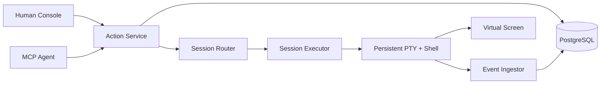

# iTerminal

> **One shell. Many minds. Every action accounted for.**

```text
                 ┌──────────────────────────────────────┐
 Human ─────────▶│                                      │
 Agent ─────────▶│  ACTION RUNTIME  ·  EVENT TIMELINE  │─────────┐
 Scheduler ─────▶│                                      │         │
                 └──────────────────────────────────────┘         ▼
                                                           ┌────────────┐
                                                           │ REAL PTY   │
                                                           │ REAL SHELL │
                                                           └─────┬──────┘
                                                                 ▼
                                                    one changing environment
```

iTerminal is a local-first terminal runtime where humans and agents are equal actors in the same persistent shell session. They share the same `cwd`, exported environment, foreground process, REPL, and terminal screen. Neither side gets a hidden bypass: execute, input, and control operations enter one structured Action Runtime and leave an attributable event trail.

This is not another stateless `exec()` wrapper, and it is not an “agent drives, human takes over” terminal. The hard problem here is coordination around a live, stateful operating-system resource.

## The contract

```text
Session generation N
  └── one persistent PTY
       └── one persistent Shell
            └── zero or one foreground Execution
```

- `cd`, `export`, `source`, `nvm use`, and similar mutations happen in the real top-level shell.
- One session accepts at most one active ExecuteAction. A competing execute fails fast with `PTY_BUSY`.
- Input and control target an exact execution generation; stale writes are rejected.
- Human output is live and high-bandwidth. Agent observation is bounded and addressable.
- An uncertain external side effect becomes `UNKNOWN`; it is never blindly replayed.
- A lost PTY cannot migrate or resurrect. Rebuild creates a new generation from a limited checkpoint.

## Why it is different

Most terminal tools optimize for command execution or remote administration. iTerminal focuses on the shared-runtime semantics between actors:

| Concern      | iTerminal choice                                                    |
| ------------ | ------------------------------------------------------------------- |
| Environment  | One real persistent shell per session generation                    |
| Coordination | Structured Execute, Input, and Control actions                      |
| Contention   | Fail fast with `PTY_BUSY`; fork a session for parallel work         |
| Freshness    | Session generation, target execution, and screen version checks     |
| Observation  | Append-only events plus a versioned virtual screen                  |
| Recovery     | Durable facts in PostgreSQL; live PTY loss becomes `BROKEN/UNKNOWN` |
| Reliability  | PostgreSQL Outbox + RabbitMQ wake-up + Inbox; no exactly-once claim |

## Current status

**M0–M4.1 and the M8.9 local admission/crash/recovery path pass at L2: shared Shell, durable Action Runtime, real stdio MCP, reliable queue-driven PTY dispatch, non-replayable uncertain interactions, bounded delivery backlog, silent-network recovery, and real three-node RabbitMQ quorum leader failover.**

Real local bash and zsh PTY scenarios prove command boundaries, shared state, fail-fast Busy, structured Input/Control, stale-target rejection, marker-spoof isolation, large output, and Ctrl+C recovery. With `ITERM_DATABASE_URL`, the live daemon now commits Execute/Input/Control admission before PTY delivery, sends attributed output through a bounded per-Session ingest loop, serves durable cursors, and marks a `SIGKILL`-lost owner generation `BROKEN/UNKNOWN` on restart. An official MCP SDK Client drives the same live zsh across stdio bridge restarts; OpenCode and Claude Code handshakes also pass. In-memory development mode remains available, but no model-driven Agent has been authorized and the Human Console is not complete.

M8.2 keeps RabbitMQ as an at-least-once wake-up plane and adds a separately supervised Execution Worker. M8.3 extends the conservative write-attempt boundary to Input/Control and rate-limits NACK/requeue when retry publication is unavailable. M8.4 bounds unpublished Outbox rows and returns retryable `BACKPRESSURE` before reserving a Session. M8.5 adds bounded RabbitMQ publisher/consumer reconnect supervision. M8.6 treats PostgreSQL loss as an owner-wide safety event: a health probe closes every owner PTY, degraded RPC admits nothing, and Pool recovery cannot restore readiness until durable generations converge to `BROKEN/UNKNOWN`. M8.7 gives the standalone relay and Worker the same bounded database connectivity lifecycle. M8.8 adds explicit AMQP heartbeat and database query deadlines, then proves recovery through a TCP proxy that silently drops PostgreSQL/RabbitMQ bytes without closing sockets. M8.9 adds ordered broker endpoint rotation and proves progress through an actual three-node quorum queue leader election while the failed leader remains down. Worker loss before RPC is retried, while Runtime loss after any PTY write attempt is never blindly replayed. This is not an exactly-once claim; asymmetric or minority partitions, correlated outages, and long-soak M8 gates remain open.

See:

- [TODO.md](./TODO.md) — full roadmap, acceptance gates, failure matrix, and Definition of Done.
- [Architecture decisions](./docs/adr/README.md) — why the runtime uses these semantics.
- [Terminology](./docs/TERMINOLOGY.md) — canonical domain language.
- [M0 spike](./spikes/shell-integration/README.md) — the highest-risk hypothesis and its evidence.
- [M0 verification](./docs/verification/M0/2026-08-30-shell-integration.md) — environment, scenarios, limits, and L2 boundary.
- [M1 verification](./docs/verification/M1/2026-08-30-runtime-cli.md) — Runtime/CLI scenarios and remaining durability boundary.
- [M2 verification](./docs/verification/M2/2026-08-30-postgres-persistence.md) — real PostgreSQL concurrency, rollback, and recovery evidence.
- [M3 observation architecture](./docs/architecture/bounded-observation.md) — query, cursor, search, and artifact bounds.
- [M3 verification](./docs/verification/M3/2026-08-30-bounded-observation.md) — real PostgreSQL 100k-line and slow-consumer evidence.
- [M4 daemon/MCP decision](./docs/adr/0007-runtime-daemon-mcp-bridge.md) — why Client lifecycle cannot own the PTY.
- [M4 MCP protocol](./docs/protocol/m4-mcp-tools.md) — tools, Actor binding, results, and errors.
- [M4 verification](./docs/verification/M4/2026-08-30-mcp-adapter.md) — official SDK, OpenCode, Claude Code, and remaining L3 boundary.
- [M4.1 durability decision](./docs/adr/0008-live-runtime-durable-journal.md) — live PTY truth, write-ahead facts, and the bounded ingest loop.
- [M4.1 verification](./docs/verification/M4/2026-08-30-durable-runtime.md) — real PostgreSQL/MCP Actions and daemon crash recovery.
- [M8.1 messaging decision](./docs/adr/0009-outbox-rabbitmq-inbox.md) — why confirms, ACKs, Inbox leases, and DB rechecks are separate boundaries.
- [M8.1 verification](./docs/verification/M8/2026-08-30-reliable-messaging.md) — real PostgreSQL/RabbitMQ duplicate, retry, DLQ, and relay lifecycle evidence.
- [M8.2 dispatch decision](./docs/adr/0010-owner-local-queue-dispatch.md) — owner-local RPC, dispatch idempotency, and PTY write uncertainty.
- [M8.2 verification](./docs/verification/M8/2026-08-30-owner-dispatch.md) — real queue-driven zsh and Worker/Runtime `SIGKILL` evidence.
- [M8.3 interaction decision](./docs/adr/0011-interaction-write-uncertainty.md) — durable Input/Control intent and terminal uncertainty.
- [M8.3 retry-outage decision](./docs/adr/0012-retry-publish-outage-backoff.md) — preserving the original delivery without a hot loop.
- [M8.3 verification](./docs/verification/M8/2026-08-30-interaction-crash-retry-outage.md) — real PTY write-after-`SIGKILL` and retry-exchange outage evidence.
- [M8.4 admission decision](./docs/adr/0013-admission-outbox-backpressure.md) — bounded pending delivery, retryable pressure, and database timeout semantics.
- [M8.4 verification](./docs/verification/M8/2026-08-30-admission-backpressure.md) — real pre-commit crash, concurrent backlog, RabbitMQ drain, and PostgreSQL lock evidence.
- [M8.5 reconnect decision](./docs/adr/0014-rabbitmq-reconnect-supervision.md) — why reconnect restores transport availability without replaying ambiguous effects.
- [M8.5 verification](./docs/verification/M8/2026-08-30-rabbitmq-process-reconnect.md) — real broker process restart, cold-start recovery, and exactly-once-claim boundary evidence.
- [M8.6 PostgreSQL decision](./docs/adr/0015-postgres-owner-circuit-reconciliation.md) — why database loss breaks the whole Runtime owner and recovery must reconcile first.
- [M8.6 verification](./docs/verification/M8/2026-08-30-postgres-process-recovery.md) — real database process restart, owner-wide PTY loss, Pool reconnect, and cold-start evidence.
- [M8.7 messaging-loop decision](./docs/adr/0016-messaging-loop-postgres-supervision.md) — why relay/Worker pause on database loss and resume from durable leases.
- [M8.7 verification](./docs/verification/M8/2026-08-30-postgres-loop-recovery.md) — real relay/Worker child-process survival, cold start, and post-recovery dispatch evidence.
- [M8.8 network decision](./docs/adr/0017-network-blackhole-liveness.md) — why established sockets need heartbeat/query deadlines under silent packet loss.
- [M8.8 verification](./docs/verification/M8/2026-08-30-network-blackhole-recovery.md) — real TCP byte-drop, bounded detection, durable recovery, and no duplicate PTY write evidence.
- [M8.9 quorum decision](./docs/adr/0018-rabbitmq-quorum-endpoint-failover.md) — why broker-side election must be paired with client endpoint rotation.
- [M8.9 verification](./docs/verification/M8/2026-08-30-rabbitmq-quorum-failover.md) — actual leader discovery/stop, replacement election, pending Outbox completion, and no duplicate PTY write evidence.

## Planned shape



The codebase will remain a modular monolith until the runtime semantics are proven. RabbitMQ and multi-worker ownership appear only after durable state, crash semantics, and owner routing have evidence.

## Development

Prerequisites:

- Node.js 22 or newer
- pnpm 10
- macOS or Linux for the PTY spike
- bash and/or zsh

After dependencies are installed:

```bash
pnpm verify
pnpm cli
ITERM_RUNTIME_SOCKET=/tmp/iterminal.sock pnpm daemon
ITERM_RUNTIME_SOCKET=/tmp/iterminal.sock pnpm mcp
ITERM_DATABASE_URL=postgresql://... ITERM_EXECUTION_DISPATCH=external \
  ITERM_RUNTIME_SOCKET=/tmp/iterminal.sock pnpm daemon
ITERM_DATABASE_URL=postgresql://... ITERM_RABBITMQ_URL=amqp://... pnpm outbox-relay
ITERM_DATABASE_URL=postgresql://... ITERM_RABBITMQ_URL=amqp://... \
  ITERM_RUNTIME_SOCKET=/tmp/iterminal.sock pnpm execution-worker
pnpm spike:shell -- --shell zsh
pnpm spike:shell -- --shell bash
```

The plain daemon command above starts explicit in-memory development mode. To run the M8 path, start PostgreSQL and RabbitMQ, then launch the daemon with `ITERM_DATABASE_URL`, `ITERM_EXECUTION_DISPATCH=external`, and a socket; launch the Outbox relay and Execution Worker against the same database/broker, and point MCP at that socket. `ITERM_RABBITMQ_URLS` accepts an ordered comma-separated broker list and takes precedence over the single-endpoint `ITERM_RABBITMQ_URL` fallback. `ITERM_OUTBOX_MAX_PENDING` bounds unpublished work (default 10,000), while `ITERM_DATABASE_STATEMENT_TIMEOUT_MS` bounds Runtime admission/database waits (default 30,000 ms). `ITERM_DATABASE_CONNECTION_TIMEOUT_MS` and `ITERM_DATABASE_OPERATION_TIMEOUT_MS` bound relay/Worker database waits (defaults 5,000/30,000 ms). PostgreSQL health probes default to 1,000 ms; `ITERM_DATABASE_HEALTH_CHECK_MS`, `ITERM_DATABASE_RECONNECT_INITIAL_MS`, and `ITERM_DATABASE_RECONNECT_MAX_MS` tune Runtime/relay/Worker detection and recovery. RabbitMQ heartbeat defaults to five seconds; `ITERM_RABBITMQ_HEARTBEAT_SECONDS`, `ITERM_RABBITMQ_RECONNECT_INITIAL_MS`, and `ITERM_RABBITMQ_RECONNECT_MAX_MS` tune liveness/reconnect. Stable owner IDs derive from the socket unless explicitly configured. PostgreSQL durability does not sandbox Shell commands or resurrect a lost PTY.

The repository does not yet have a final license. That decision is intentionally tracked in the roadmap instead of being silently assumed.

## Honesty over theatre

The README is dramatic. The completion claims are not.

Every milestone uses L0–L4 evidence levels. A green build is not a shared-terminal scenario. A mock client is not a real MCP Agent. A database row is not proof that a shell command ran. The project is complete only when the real Human/Agent path and its failure modes have been exercised end to end.
