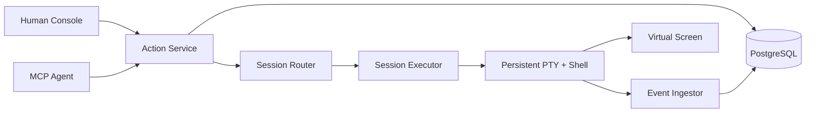

# iTerminal

> **One shell. Many minds. Every action accounted for.**

```text
                 ┌──────────────────────────────────────┐
 Human ─────────▶│                                      │
 Agent ─────────▶│  ACTION RUNTIME  ·  EVENT TIMELINE  │─────────┐
 Scheduler ─────▶│                                      │         │
                 └──────────────────────────────────────┘         ▼
                                                           ┌────────────┐
                                                           │ REAL PTY   │
                                                           │ REAL SHELL │
                                                           └─────┬──────┘
                                                                 ▼
                                                    one changing environment
```

iTerminal is a local-first terminal runtime where humans and agents are equal actors in the same persistent shell session. They share the same `cwd`, exported environment, foreground process, REPL, terminal screen, and canonical geometry. Neither side gets a hidden bypass: execute, input, control, and resize operations enter one structured Action Runtime and leave an attributable event trail.

This is not another stateless `exec()` wrapper, and it is not an “agent drives, human takes over” terminal. The hard problem here is coordination around a live, stateful operating-system resource.

## The contract

```text
Session generation N
  └── one persistent PTY
       └── one persistent Shell
            └── zero or one foreground Execution
```

- `cd`, `export`, `source`, `nvm use`, and similar mutations happen in the real top-level shell.
- One session accepts at most one active ExecuteAction. A competing execute fails fast with `PTY_BUSY`.
- Input and control target an exact execution generation; stale writes are rejected.
- A versioned input policy and short Human Interaction Guard prevent semantic input races without creating terminal ownership.
- Human output is live and high-bandwidth. Agent observation is bounded and addressable.
- An uncertain external side effect becomes `UNKNOWN`; it is never blindly replayed.
- A lost PTY cannot migrate or resurrect. Rebuild creates a new Session generation from a limited checkpoint.

## Why it is different

Most terminal tools optimize for command execution or remote administration. iTerminal focuses on the shared-runtime semantics between actors:

| Concern      | iTerminal choice                                                    |
| ------------ | ------------------------------------------------------------------- |
| Environment  | One real persistent shell per session generation                    |
| Coordination | Structured Actions plus versioned policy and short Human Guards     |
| Contention   | Fail fast with `PTY_BUSY`; fork a session for parallel work         |
| Freshness    | Session generation, target execution, and screen version checks     |
| Observation  | Append-only events plus a versioned virtual screen                  |
| Recovery     | Durable BROKEN evidence; explicit rebuild creates a new Session/PTY |
| Reliability  | PostgreSQL Outbox + RabbitMQ wake-up + Inbox; no exactly-once claim |

## Current status

**M5 and M6.6 pass real L3 shared-transport paths: a headless Chrome Human Console and official MCP SDK Agent share one PostgreSQL-backed zsh, cwd/env, Python REPL, Interaction Guard, screen, attributed Timeline, and versioned canonical PTY geometry. M7.2 adds an L3 Browser Human path that inspects a same-owner historical `BROKEN` checkpoint after daemon loss and explicitly rebuilds a new Session/PTY. M6.7, M7.1, and M9.1–M9.17 retain L2 real-PTY/PostgreSQL evidence for bounded terminal classification, versioned checkpoint fork, boot-incarnation lifecycle, central multi-owner routing, generation-scoped durable-write fencing, atomic capacity-weighted placement, durable Action rate limits, independent-process owner failure recovery, owner/Router database-path isolation, Router cold-start recovery, in-flight crashes, bounded durable root-Session idempotency, pre-drain placement settlement, repeated rolling owner replacement, CPU-starved owner fencing, controlled PostgreSQL minority-to-promoted-primary recovery, and host-local reclamation of an unreachable Runtime's PTY process tree. M0–M4.1, M6.5 backend safety, and the M8.9 admission/crash/recovery path retain their separately recorded L2 claims; their broader L3/L4 gates remain open where stated.**

Real local bash and zsh PTY scenarios prove command boundaries, shared state, fail-fast Busy, structured Input/Control/Resize, stale-target rejection, marker-spoof isolation, large output, and Ctrl+C recovery. With `ITERM_DATABASE_URL`, the live daemon commits Action admission before PTY delivery, sends attributed output through a bounded per-Session ingest loop, serves durable cursors, and marks a `SIGKILL`-lost owner generation `BROKEN/UNKNOWN` on restart. M5 adds a loopback-only Fastify adapter and React+xterm.js page: READY uses a command composer; RUNNING groups raw keys into guarded InputActions; HTTP Host/Origin/Cookie checks bind one Human Actor; bounded WebSocket frames resume durable cursors and fully resynchronize the canonical screen. M6.1–M6.7 provide the shared headless screen, bounded reads/waits/diffs/styles, generation-scoped interaction policy, controlled geometry, and explainable `terminal_state` evidence. M7.1 adds exact checkpoint CAS, operator-allowlisted environment capture, PostgreSQL child lineage/idempotency, and READY/RUNNING/BROKEN parent fork into a new PTY without copying process/REPL/editor state. M7.2 hydrates at most the newest 100 valid same-owner historical parents as read-only `BROKEN` projections with no Executor/Screen/Guard; the Human must inspect and acknowledge stale context before the existing Actor-attributed fork path creates a distinct Session/PTY. Viewer layout never owns PTY geometry. Stable and heuristic labels remain explicitly different from prompt readiness, authorization, completion, Approval, and secret-channel state. OpenCode and Claude Code handshakes also pass, but no model-driven Agent has been authorized. Cross-owner hydration/fencing, broader TUI/cross-browser/style parity, daemon-restart durable waits, Approval/secret handling, and remote authentication remain incomplete.

M8.2 keeps RabbitMQ as an at-least-once wake-up plane and adds a separately supervised Execution Worker. M8.3 extends the conservative write-attempt boundary to Input/Control and rate-limits NACK/requeue when retry publication is unavailable. M8.4 bounds unpublished Outbox rows and returns retryable `BACKPRESSURE` before reserving a Session. M8.5 adds bounded RabbitMQ publisher/consumer reconnect supervision. M8.6 treats PostgreSQL loss as an owner-wide safety event: a health probe closes every owner PTY, degraded RPC admits nothing, and Pool recovery cannot restore readiness until durable generations converge to `BROKEN/UNKNOWN`. M8.7 gives the standalone relay and Worker the same bounded database connectivity lifecycle. M8.8 adds explicit AMQP heartbeat and database query deadlines, then proves recovery through a TCP proxy that silently drops PostgreSQL/RabbitMQ bytes without closing sockets. M8.9 adds ordered broker endpoint rotation and proves progress through an actual three-node quorum queue leader election while the failed leader remains down. Worker loss before RPC is retried, while Runtime loss after any PTY write attempt is never blindly replayed. This is not an exactly-once claim; asymmetric or minority partitions, correlated outages, and long-soak M8 gates remain open.

M9.1 adds a PostgreSQL Runtime owner registry with stable logical owner IDs, boot-unique instance IDs, monotonic registry epochs, database-time heartbeat leases, drain/stop lifecycle, and stale-identity rejection. Registration happens before durable recovery, so a conflicting same-owner daemon cannot break the live owner's Sessions; loss of the registered identity conservatively destroys local PTY state. M9.2 adds one stable local Unix Router that resolves durable Session/Execution owners, excludes draining owners from placement, forwards exact calls to active/draining daemons, supports an explicit owner-agnostic Execution Worker mode, and preserves `DELIVERY_UNKNOWN` after uncertain writes. M9.3 adds generation-scoped Session leases with globally monotonic fencing tokens, exact-set renewal capped by owner expiry, transactional close/broken release, and current-owner + Session-fence validation for every live durable mutation. Execution transitions additionally use independent expected versions. M9.4 serializes short PostgreSQL placement claims across Router processes, balances attempt counts across ACTIVE owners, excludes DRAINING owners, and admits durable Actor/Session Actions through configurable database-time fixed windows in the same transaction as state mutation. `RATE_LIMITED` is retryable with a database-derived delay; idempotent replay and rollback consume no quota. M9.5 composes one independent Router and three independent Runtime processes: Router `SIGKILL` is stateless, Runtime `SIGKILL` leaves only `BROKEN/UNKNOWN` durable history, same-owner replacement advances registry epoch without taking over the old PTY, and graceful `SIGTERM` stops later placement. M9.6 isolates one Runtime behind a silent PostgreSQL blackhole: only that owner trips its durability circuit and expires from placement, healthy owners continue serving, stale TCP streams are reset before reconnect, and recovery preserves old `BROKEN/UNKNOWN` history while admitting only a new Session/PTY. M9.7 kills independent Routers after a committed placement claim and after a successful idempotent owner mutation: the claim remains an attempt without a ghost Session, while the mutation settles through its original idempotency key to one Action, one Execution, and one observed Shell effect. M9.8 gives root `session.create` a durable global idempotency intent: placement and exact owner incarnation are claimed once, the owner transaction atomically binds one Session ID, post-forward Router response loss replays that Session, conflicting payload reuse is rejected, and concurrent Routers do not create a second PTY. M9.9 isolates one Router behind a silent PostgreSQL blackhole: it returns bounded, route-phase `RUNTIME_UNAVAILABLE` before owner forwarding while a healthy Router and both owners continue; cutting stale streams restores the same Router process and exact-key creation without an extra placement. M9.10 supervises Router PostgreSQL cold start: the stable socket listens in degraded mode, migration/health retry stays bounded, requests fail before route/owner work, and the same process transitions to READY after connectivity returns. M9.11 adds a PostgreSQL-authoritative root-create retention/capacity policy: existing work settles at capacity, active/live work is pinned, terminal/stale intents are reclaimed in bounded batches, and expired keys start a new Session contract. M9.12 persists `DRAINING` before shutdown, waits within one deadline for exact-owner pre-drain creation intents, gracefully drains accepted RPC responses, then closes Sessions and persists `STOPPED`; timeout never reassigns exact-owner work. M9.13 repeats two full A/B/C drain-and-replacement cycles during 48 concurrent root creates: all keys bind distinct Sessions, every round retains healthy-owner zsh progress, and final replacements are ACTIVE at epoch 3. M9.14 makes database-time expiry an atomic heartbeat/drain/stop fence: a `SIGSTOP`-starved owner cannot transiently revive routing, loses its old PTY, and returns only through full reconcile recovery while a healthy owner continues. M9.15 adds bounded relative capacity weights and atomically schedules by normalized historical placement debt; real weights 1:2:3 converge to 6/12/18 across drain and replacement. M9.16 adds primary-only ordered PostgreSQL endpoints and proves a reachable synchronous minority fails closed; after the external control plane stops the former primary and promotes a quorum-backed standby, the same Runtime/Router processes reconcile `BROKEN/UNKNOWN` and admit only a new PTY. M9.17 adds one independent host-local Guardian per durable Runtime: successful database lease renewal arms it, Runtime loss freezes and terminates the registered PTY process tree before user code can advance, and PostgreSQL expires frozen idle transactions so a replacement can reconcile `BROKEN/UNKNOWN`. Whole-host/VM fencing, high-cardinality rolling operation, and long-duration soak gates remain open.

See:

- [TODO.md](./TODO.md) — full roadmap, acceptance gates, failure matrix, and Definition of Done.
- [Architecture decisions](./docs/adr/README.md) — why the runtime uses these semantics.
- [Terminology](./docs/TERMINOLOGY.md) — canonical domain language.
- [M0 spike](./spikes/shell-integration/README.md) — the highest-risk hypothesis and its evidence.
- [M0 verification](./docs/verification/M0/2026-08-30-shell-integration.md) — environment, scenarios, limits, and L2 boundary.
- [M1 verification](./docs/verification/M1/2026-08-30-runtime-cli.md) — Runtime/CLI scenarios and remaining durability boundary.
- [M2 verification](./docs/verification/M2/2026-08-30-postgres-persistence.md) — real PostgreSQL concurrency, rollback, and recovery evidence.
- [M3 observation architecture](./docs/architecture/bounded-observation.md) — query, cursor, search, and artifact bounds.
- [M3 verification](./docs/verification/M3/2026-08-30-bounded-observation.md) — real PostgreSQL 100k-line and slow-consumer evidence.
- [M4 daemon/MCP decision](./docs/adr/0007-runtime-daemon-mcp-bridge.md) — why Client lifecycle cannot own the PTY.
- [M4 MCP protocol](./docs/protocol/m4-mcp-tools.md) — tools, Actor binding, results, and errors.
- [M4 verification](./docs/verification/M4/2026-08-30-mcp-adapter.md) — official SDK, OpenCode, Claude Code, and remaining L3 boundary.
- [M4.1 durability decision](./docs/adr/0008-live-runtime-durable-journal.md) — live PTY truth, write-ahead facts, and the bounded ingest loop.
- [M4.1 verification](./docs/verification/M4/2026-08-30-durable-runtime.md) — real PostgreSQL/MCP Actions and daemon crash recovery.
- [M5 Console decision](./docs/adr/0024-human-console-transport.md) — why HTTP/WS remains a loopback Runtime adapter rather than a PTY owner.
- [M5 Console protocol](./docs/protocol/m5-human-console.md) — HTTP resources, WebSocket sync, browser identity, mode, and Guard contracts.
- [M5 verification](./docs/verification/M5/2026-08-30-human-console.md) — real Chrome Human Console + official MCP SDK Agent shared cwd/env/REPL evidence.
- [M6.1 Virtual Screen decision](./docs/adr/0019-live-virtual-screen-projection.md) — why terminal emulation lives once in the Runtime owner behind a pinned adapter.
- [M6.1 verification](./docs/verification/M6/2026-08-30-live-virtual-screen.md) — real PTY/MCP normal and alternate viewport, Unicode, cursor, version, and guarded-input evidence.
- [M6.2 reactive observation decision](./docs/adr/0020-reactive-screen-observation.md) — why search is viewport-scoped and waits use parser-driven notifications.
- [M6.2 verification](./docs/verification/M6/2026-08-30-reactive-screen-observation.md) — real PTY/MCP search, waits, timeout, and RPC disconnect-cancellation evidence.
- [M6.3 bounded sync decision](./docs/adr/0021-bounded-screen-region-diff.md) — why region coordinates are terminal cells and missing revisions require explicit resync.
- [M6.3 verification](./docs/verification/M6/2026-08-30-bounded-screen-sync.md) — real PTY/MCP region, row-diff, revision eviction, and resync evidence.
- [M6.4 styled-cell decision](./docs/adr/0022-stable-screen-cell-style-dto.md) — why xterm attributes become sparse stable domain DTOs and unsupported rich protocols stay explicit.
- [M6.4 verification](./docs/verification/M6/2026-08-30-styled-screen-cells.md) — real ANSI/VT palette, RGB, SGR, styled-space, and wide-cell evidence through MCP.
- [M6.5 interaction decision](./docs/adr/0023-generation-scoped-interaction-policy.md) — why policy and short Human Guards coordinate input without ownership.
- [M6.5 verification](./docs/verification/M6/2026-08-30-interaction-guard.md) — real PostgreSQL/PTY/Human RPC/official MCP policy and Guard evidence.
- [M6.6 geometry decision](./docs/adr/0025-controlled-terminal-geometry.md) — why the Runtime owns one versioned geometry and every resize is an Action.
- [M6.6 verification](./docs/verification/M6/2026-08-30-controlled-terminal-geometry.md) — real Chrome Human + official MCP Agent resize, SIGWINCH, CAS, reflow, resync, and durable attribution evidence.
- [M6.7 terminal-state decision](./docs/adr/0026-bounded-terminal-state-evidence.md) — why terminal classification is bounded advisory evidence rather than a new source of truth.
- [M6.7 verification](./docs/verification/M6/2026-08-30-terminal-state-evidence.md) — real bash/zsh, REPL, editor, pager, monitor, confirmation, password-like, and spoof fixtures through official MCP.
- [M7.1 checkpoint/fork decision](./docs/adr/0027-versioned-shell-checkpoint-fork.md) — why fork is a versioned filtered rebuild rather than a PTY/process clone.
- [M7.1 verification](./docs/verification/M7/2026-08-30-checkpoint-fork.md) — real bash/zsh, official MCP, PostgreSQL lineage/idempotency, READY/busy/BROKEN, and invalid-cwd evidence.
- [M7.2 durable rebuild decision](./docs/adr/0028-durable-broken-session-rebuild-projection.md) — why a fresh daemon hydrates only bounded `BROKEN` reconstruction evidence, never a fake live PTY.
- [M7.2 verification](./docs/verification/M7/2026-08-30-durable-human-rebuild.md) — real Chrome Human inspection, stale acknowledgement, same-owner historical hydration, new zsh/PTY, `git status`, lineage, and attribution evidence.
- [M8.1 messaging decision](./docs/adr/0009-outbox-rabbitmq-inbox.md) — why confirms, ACKs, Inbox leases, and DB rechecks are separate boundaries.
- [M8.1 verification](./docs/verification/M8/2026-08-30-reliable-messaging.md) — real PostgreSQL/RabbitMQ duplicate, retry, DLQ, and relay lifecycle evidence.
- [M9.1 owner registry decision](./docs/adr/0029-runtime-owner-registry-and-central-router.md) — why owner, boot instance, registry epoch, and later Session fencing are separate facts.
- [M9.1 verification](./docs/verification/M9/2026-08-30-runtime-owner-registry.md) — real PostgreSQL/PTY conflict, heartbeat, drain/stop, expiry, concurrent replacement, and stale-identity evidence.
- [M9.2 Router decision](./docs/adr/0030-central-runtime-router-forwarding.md) — stable RPC reuse, database-authoritative route selection, and fail-closed forwarding semantics.
- [M9.2 verification](./docs/verification/M9/2026-08-30-central-runtime-router.md) — official MCP, Router-mode queue Worker, two Runtime owners, drain, missing route, and uncertain delivery evidence.
- [M9.3 Session fencing decision](./docs/adr/0031-generation-scoped-session-fencing.md) — why owner incarnation, Session fence, and Execution expected version are three separate guarantees.
- [M9.3 verification](./docs/verification/M9/2026-08-30-session-fencing.md) — real PostgreSQL/PTY renewal, stale-write rejection, lease revocation, owner replacement, recovery, and regression evidence.
- [M9.4 placement/rate-limit decision](./docs/adr/0032-atomic-placement-and-durable-action-rate-limits.md) — why placement is an atomic attempt claim and rate limits belong inside durable Action admission.
- [M9.4 verification](./docs/verification/M9/2026-08-30-fair-placement-rate-limits.md) — three real Runtime owners, concurrent 4/4/4 placement, drain, cross-owner Actor limits, Session limits, replay, rollback, and reset evidence.
- [M9.5 process-chaos decision](./docs/adr/0033-independent-process-owner-failure-recovery.md) — why Router restart, Runtime replacement, and graceful drain preserve old-generation fencing.
- [M9.5 verification](./docs/verification/M9/2026-08-30-independent-process-chaos.md) — independent Router/Runtime processes, `SIGKILL`, replacement epoch, `BROKEN/UNKNOWN`, new PTY-only recovery, and `SIGTERM` stop evidence.
- [M9.6 partition decision](./docs/adr/0034-asymmetric-owner-database-partition.md) and [verification](./docs/verification/M9/2026-08-30-asymmetric-owner-partition.md) — isolate one owner's silent PostgreSQL blackhole while healthy owners continue.
- [M9.7 Router crash decision](./docs/adr/0035-router-in-flight-crash-boundaries.md) and [verification](./docs/verification/M9/2026-08-30-router-in-flight-crash.md) — preserve claim and idempotent mutation truth across in-flight Router `SIGKILL`.
- [M9.8 root creation decision](./docs/adr/0036-durable-root-session-idempotency.md) and [verification](./docs/verification/M9/2026-08-30-root-session-idempotency.md) — settle post-forward response loss and concurrent Router replay to one durable Session.
- [M9.9 Router partition decision](./docs/adr/0037-router-database-partition-isolation.md) and [verification](./docs/verification/M9/2026-08-30-router-database-partition.md) — fail one database-isolated Router closed while healthy Routers and owners continue.
- [M9.10 Router cold-start decision](./docs/adr/0038-router-cold-start-database-supervision.md) and [verification](./docs/verification/M9/2026-08-30-router-cold-start-recovery.md) — listen degraded, retry PostgreSQL, and recover the same Router process without stale routing.
- [M9.11 creation-retention decision](./docs/adr/0039-bounded-session-creation-idempotency.md) and [verification](./docs/verification/M9/2026-08-30-session-creation-retention.md) — bound hostile root keys without deleting active Session or live-owner settlement truth.
- [M9.12 drain-settlement decision](./docs/adr/0040-bounded-runtime-drain-settlement.md) and [verification](./docs/verification/M9/2026-08-30-runtime-drain-settlement.md) — settle a placement committed before `DRAINING` and drain its response before Runtime stop.
- [M9.13 rolling-drain decision](./docs/adr/0041-repeated-rolling-owner-drain.md) and [verification](./docs/verification/M9/2026-08-30-repeated-rolling-drain.md) — preserve unique root-create settlement and healthy-owner progress across six drain/replacement rounds.
- [M9.14 CPU-starvation decision](./docs/adr/0042-expired-owner-heartbeat-recovery.md) and [verification](./docs/verification/M9/2026-08-30-cpu-starved-owner.md) — reject expired heartbeat revival and require full old-PTY reconciliation before same-process recovery.
- [M9.15 capacity-weight decision](./docs/adr/0043-capacity-weighted-runtime-placement.md) and [verification](./docs/verification/M9/2026-08-30-capacity-weighted-placement.md) — preserve exact 1:2:3 relative placement through drain, replacement, and real zsh work.
- [M9.16 PostgreSQL quorum decision](./docs/adr/0044-postgres-quorum-primary-failover.md) and [verification](./docs/verification/M9/2026-08-30-postgres-quorum-failover.md) — fail a reachable synchronous minority closed, then follow an externally fenced and promoted primary without reviving the old PTY.
- [M9.17 Process Guardian decision](./docs/adr/0045-host-local-process-guardian.md) and [verification](./docs/verification/M9/2026-08-30-host-local-process-reclamation.md) — reclaim a stopped Runtime's foreground/background PTY process tree and frozen database transaction before replacement recovery.
- [M8.2 dispatch decision](./docs/adr/0010-owner-local-queue-dispatch.md) — owner-local RPC, dispatch idempotency, and PTY write uncertainty.
- [M8.2 verification](./docs/verification/M8/2026-08-30-owner-dispatch.md) — real queue-driven zsh and Worker/Runtime `SIGKILL` evidence.
- [M8.3 interaction decision](./docs/adr/0011-interaction-write-uncertainty.md) — durable Input/Control intent and terminal uncertainty.
- [M8.3 retry-outage decision](./docs/adr/0012-retry-publish-outage-backoff.md) — preserving the original delivery without a hot loop.
- [M8.3 verification](./docs/verification/M8/2026-08-30-interaction-crash-retry-outage.md) — real PTY write-after-`SIGKILL` and retry-exchange outage evidence.
- [M8.4 admission decision](./docs/adr/0013-admission-outbox-backpressure.md) — bounded pending delivery, retryable pressure, and database timeout semantics.
- [M8.4 verification](./docs/verification/M8/2026-08-30-admission-backpressure.md) — real pre-commit crash, concurrent backlog, RabbitMQ drain, and PostgreSQL lock evidence.
- [M8.5 reconnect decision](./docs/adr/0014-rabbitmq-reconnect-supervision.md) — why reconnect restores transport availability without replaying ambiguous effects.
- [M8.5 verification](./docs/verification/M8/2026-08-30-rabbitmq-process-reconnect.md) — real broker process restart, cold-start recovery, and exactly-once-claim boundary evidence.
- [M8.6 PostgreSQL decision](./docs/adr/0015-postgres-owner-circuit-reconciliation.md) — why database loss breaks the whole Runtime owner and recovery must reconcile first.
- [M8.6 verification](./docs/verification/M8/2026-08-30-postgres-process-recovery.md) — real database process restart, owner-wide PTY loss, Pool reconnect, and cold-start evidence.
- [M8.7 messaging-loop decision](./docs/adr/0016-messaging-loop-postgres-supervision.md) — why relay/Worker pause on database loss and resume from durable leases.
- [M8.7 verification](./docs/verification/M8/2026-08-30-postgres-loop-recovery.md) — real relay/Worker child-process survival, cold start, and post-recovery dispatch evidence.
- [M8.8 network decision](./docs/adr/0017-network-blackhole-liveness.md) — why established sockets need heartbeat/query deadlines under silent packet loss.
- [M8.8 verification](./docs/verification/M8/2026-08-30-network-blackhole-recovery.md) — real TCP byte-drop, bounded detection, durable recovery, and no duplicate PTY write evidence.
- [M8.9 quorum decision](./docs/adr/0018-rabbitmq-quorum-endpoint-failover.md) — why broker-side election must be paired with client endpoint rotation.
- [M8.9 verification](./docs/verification/M8/2026-08-30-rabbitmq-quorum-failover.md) — actual leader discovery/stop, replacement election, pending Outbox completion, and no duplicate PTY write evidence.

## Planned shape



The codebase will remain a modular monolith until the runtime semantics are proven. RabbitMQ and multi-worker ownership appear only after durable state, crash semantics, and owner routing have evidence.

## Development

Prerequisites:

- Node.js 22 or newer
- pnpm 10
- macOS or Linux for the PTY spike
- bash and/or zsh

After dependencies are installed:

```bash
pnpm verify
pnpm cli
ITERM_RUNTIME_SOCKET=/tmp/iterminal.sock pnpm daemon
ITERM_RUNTIME_SOCKET=/tmp/iterminal.sock pnpm mcp
pnpm build:console
ITERM_RUNTIME_SOCKET=/tmp/iterminal.sock pnpm console
ITERM_DATABASE_URL=postgresql://... ITERM_EXECUTION_DISPATCH=external \
  ITERM_RUNTIME_SOCKET=/tmp/iterminal.sock pnpm daemon
ITERM_DATABASE_URL=postgresql://... ITERM_RABBITMQ_URL=amqp://... pnpm outbox-relay
ITERM_DATABASE_URL=postgresql://... ITERM_RABBITMQ_URL=amqp://... \
  ITERM_RUNTIME_SOCKET=/tmp/iterminal.sock pnpm execution-worker
ITERM_DATABASE_URL=postgresql://... ITERM_ROUTER_SOCKET=/tmp/iterminal-router.sock pnpm router
ITERM_DATABASE_URL=postgresql://... ITERM_RABBITMQ_URL=amqp://... \
  ITERM_RUNTIME_ROUTING_MODE=router ITERM_RUNTIME_SOCKET=/tmp/iterminal-router.sock \
  pnpm execution-worker
pnpm spike:shell -- --shell zsh
pnpm spike:shell -- --shell bash
ITERM_DATABASE_URL=postgresql://... pnpm test:m6:interaction
ITERM_DATABASE_URL=postgresql://... \
  ITERM_BROWSER_EXECUTABLE='/path/to/Chrome' pnpm test:m5:browser
ITERM_DATABASE_URL=postgresql://... pnpm test:m9:fairness
ITERM_DATABASE_URL=postgresql://... pnpm test:m9:process-chaos
bash scripts/run-m9-postgres-quorum-test.sh
ITERM_DATABASE_URL=postgresql://... pnpm test:m9:reclamation
```

The Console defaults to `http://127.0.0.1:4173` and refuses non-loopback binding; build its static assets before starting it. The plain daemon command above starts explicit in-memory development mode. To run the durable shared path, give the daemon either one `ITERM_DATABASE_URL` or an ordered comma-separated `ITERM_DATABASE_URLS` list, then point Console/MCP at one daemon socket or the Router socket. Configuring both database variables is rejected; list mode admits only an externally authorized writable primary and never promotes a standby or retries a failed SQL transaction. Durable mode defaults to 120 Actor Actions and 240 Session Actions per 1,000 ms; override them with `ITERM_ACTOR_ACTION_RATE_LIMIT`, `ITERM_SESSION_ACTION_RATE_LIMIT`, and `ITERM_ACTION_RATE_LIMIT_WINDOW_MS`. To run the M8/M9 queue path, also start RabbitMQ, use `ITERM_EXECUTION_DISPATCH=external`, and launch the Outbox relay plus an owner-bound or explicit router-mode Execution Worker. `ITERM_RABBITMQ_URLS` accepts an ordered comma-separated broker list and takes precedence over the single-endpoint fallback. PostgreSQL/RabbitMQ timeout and reconnect variables are documented in the roadmap. Stable owner IDs derive from daemon sockets unless explicitly configured; the Router does not register as an owner. PostgreSQL durability does not sandbox Shell commands or resurrect a lost PTY.

The repository does not yet have a final license. That decision is intentionally tracked in the roadmap instead of being silently assumed.

## Honesty over theatre

The README is dramatic. The completion claims are not.

Every milestone uses L0–L4 evidence levels. A green build is not a shared-terminal scenario. A mock client is not a real MCP Agent. A database row is not proof that a shell command ran. The project is complete only when the real Human/Agent path and its failure modes have been exercised end to end.
