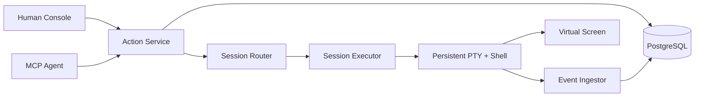

# iTerminal

> **One shell. Many minds. Every action accounted for.**

```text
                 ┌──────────────────────────────────────┐
 Human ─────────▶│                                      │
 Agent ─────────▶│  ACTION RUNTIME  ·  EVENT TIMELINE  │─────────┐
 Scheduler ─────▶│                                      │         │
                 └──────────────────────────────────────┘         ▼
                                                           ┌────────────┐
                                                           │ REAL PTY   │
                                                           │ REAL SHELL │
                                                           └─────┬──────┘
                                                                 ▼
                                                    one changing environment
```

iTerminal is a local-first terminal runtime where humans and agents are equal actors in the same persistent shell session. They share the same `cwd`, exported environment, foreground process, REPL, and terminal screen. Neither side gets a hidden bypass: execute, input, and control operations enter one structured Action Runtime and leave an attributable event trail.

This is not another stateless `exec()` wrapper, and it is not an “agent drives, human takes over” terminal. The hard problem here is coordination around a live, stateful operating-system resource.

## The contract

```text
Session generation N
  └── one persistent PTY
       └── one persistent Shell
            └── zero or one foreground Execution
```

- `cd`, `export`, `source`, `nvm use`, and similar mutations happen in the real top-level shell.
- One session accepts at most one active ExecuteAction. A competing execute fails fast with `PTY_BUSY`.
- Input and control target an exact execution generation; stale writes are rejected.
- Human output is live and high-bandwidth. Agent observation is bounded and addressable.
- An uncertain external side effect becomes `UNKNOWN`; it is never blindly replayed.
- A lost PTY cannot migrate or resurrect. Rebuild creates a new generation from a limited checkpoint.

## Why it is different

Most terminal tools optimize for command execution or remote administration. iTerminal focuses on the shared-runtime semantics between actors:

| Concern      | iTerminal choice                                                    |
| ------------ | ------------------------------------------------------------------- |
| Environment  | One real persistent shell per session generation                    |
| Coordination | Structured Execute, Input, and Control actions                      |
| Contention   | Fail fast with `PTY_BUSY`; fork a session for parallel work         |
| Freshness    | Session generation, target execution, and screen version checks     |
| Observation  | Append-only events plus a versioned virtual screen                  |
| Recovery     | Durable facts in PostgreSQL; live PTY loss becomes `BROKEN/UNKNOWN` |
| Reliability  | Outbox/MQ wake-ups later; no exactly-once fiction                   |

## Current status

**M0 Shell Integration feasibility gate passed at L2. M1 production Runtime work has not started.**

Real local bash and zsh PTY scenarios now prove command boundaries, shared `cwd`/environment, syntax and nonzero exits, marker-spoof isolation, large output, and Ctrl+C recovery. No production Runtime, MCP server, database, or web console is complete yet.

See:

- [TODO.md](./TODO.md) — full roadmap, acceptance gates, failure matrix, and Definition of Done.
- [Architecture decisions](./docs/adr/README.md) — why the runtime uses these semantics.
- [Terminology](./docs/TERMINOLOGY.md) — canonical domain language.
- [M0 spike](./spikes/shell-integration/README.md) — the highest-risk hypothesis and its evidence.
- [M0 verification](./docs/verification/M0/2026-08-30-shell-integration.md) — environment, scenarios, limits, and L2 boundary.

## Planned shape



The codebase will remain a modular monolith until the runtime semantics are proven. RabbitMQ and multi-worker ownership appear only after durable state, crash semantics, and owner routing have evidence.

## Development

Prerequisites:

- Node.js 22 or newer
- pnpm 10
- macOS or Linux for the PTY spike
- bash and/or zsh

After dependencies are installed:

```bash
pnpm verify
pnpm spike:shell -- --shell zsh
pnpm spike:shell -- --shell bash
```

The repository does not yet have a final license. That decision is intentionally tracked in the roadmap instead of being silently assumed.

## Honesty over theatre

The README is dramatic. The completion claims are not.

Every milestone uses L0–L4 evidence levels. A green build is not a shared-terminal scenario. A mock client is not a real MCP Agent. A database row is not proof that a shell command ran. The project is complete only when the real Human/Agent path and its failure modes have been exercised end to end.
