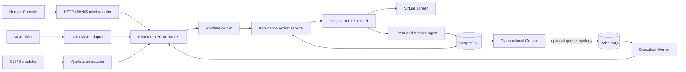

# iTerminal

[English](./README.md) | 简体中文

> **一个 Shell，多方协作，每次操作都有据可查。**

```text
                 ┌──────────────────────────────────────┐
 Human ─────────▶│                                      │
 Agent ─────────▶│  ACTION RUNTIME  ·  EVENT TIMELINE  │─────────┐
 Scheduler ─────▶│                                      │         ▼
                 └──────────────────────────────────────┘   ┌────────────┐
                                                          │ REAL PTY   │
                                                          │ REAL SHELL │
                                                          └─────┬──────┘
                                                                ▼
                                                       同一个持续变化的环境
```

iTerminal 是一个面向 Human、Agent 和 Scheduler 的本地优先共享终端运行时。所有 Actor 都通过
同一个持久化 Shell 工作，也都能看到彼此造成的变化：相同的 `cwd`、导出环境变量、前台进程、
REPL、终端屏幕和规范化终端尺寸。

它不是无状态命令执行器，不是屏幕共享包装层，也不是“Agent 操作、Human 临时接管”的终端。
它把实时终端视为一种需要协调的操作系统资源，并为其提供显式 Action、持久事实、有界观察和
保守的失败语义。

## 核心契约

```text
Session generation N
  └── one persistent PTY
       └── one persistent Shell
            └── zero or one foreground Execution
```

- `cd`、`export`、`source`、`nvm use` 等 Shell 变更发生在真实的顶层 Shell 中，并对所有
  Actor 可见。
- Execute、Input、仅限 Human 的 SecretInput、Control 和 Resize 都是不可变且可归因的
  Action。
- 一个 Session 同一时间最多接受一个活跃 ExecuteAction。发生竞争时快速返回 `PTY_BUSY`，
  不会暗中创建第二个 Shell。
- Input 和 Control 必须指向精确的 Execution 与 generation；过期写入会被拒绝。
- Human 获得实时、高带宽输出；Agent 通过有界、带版本且可寻址的方式观察终端。
- 无法确认的外部副作用会进入 `UNKNOWN`，绝不盲目重放。
- 丢失的 PTY 会进入 `BROKEN`。rebuild 和 fork 只会根据有限的 Shell Checkpoint 创建新
  PTY，不会伪装成进程树迁移或复活。

## 与其他终端工具的差异

大多数终端集成重点解决“如何执行命令”。iTerminal 重点解决“多个独立 Actor 如何安全地
共享同一个有状态终端”。

| 关注点   | iTerminal 的选择                                                                   |
| -------- | ---------------------------------------------------------------------------------- |
| 共享状态 | 每个 Session generation 只有一个真实持久化 Shell                                   |
| Actor    | Human、Agent、Scheduler 和 System 都是一等身份，并拥有显式 Capability              |
| 协作     | 结构化 Action、带版本的交互策略和短时 Human Interaction Guard                      |
| 竞争     | 同一 Session 忙碌时快速失败；需要并行时显式 fork 新 Session                        |
| 新鲜度   | 校验 generation、目标 Execution、expected version、screen version 和 Session fence |
| 观察     | 组合 append-only Event Timeline 与一个有界、带版本的 Virtual Screen                |
| 恢复     | 保留 `BROKEN`/`UNKNOWN` 证据，只允许显式重建为新 PTY                               |
| 可靠性   | PostgreSQL 保存持久真相；RabbitMQ 只是至少一次唤醒平面，不是真相来源               |

因此，没有任何 Adapter 拥有私有执行通道，也没有任何 Viewer 能在不知不觉中只修改自己看到
的 PTY 状态。

## 架构



| 层级                 | 职责                                                                                  |
| -------------------- | ------------------------------------------------------------------------------------- |
| Human Console        | 仅限 loopback 的 React + xterm.js 界面，提供实时输出、Timeline、Approval 和受保护交互 |
| MCP Adapter          | 通过 stdio 暴露有界 Agent 工具；其生命周期永远不拥有 PTY                              |
| Runtime RPC / Router | 校验作用域 Grant，直接访问单个 Runtime 或解析持久化 Owner 路由                        |
| Runtime Owner        | 拥有实时 PTY、Shell Integration Channel、Virtual Screen 和应用状态机                  |
| PostgreSQL           | 保存已接受和已观察事实、身份、Lease、Fence、Checkpoint、Cursor 与投递状态             |
| Messaging            | 通过 RabbitMQ 转发已提交 Outbox 工作，并使用 Inbox 对 Consumer 去重                   |
| Process Guardian     | 在持久化 Runtime 失联时回收其注册的本地 PTY 进程树                                    |

默认本地路径刻意采用一个 PostgreSQL-backed Runtime 和 immediate dispatch。相同契约也支持
显式 Router、多个 Runtime Owner、RabbitMQ Relay 和 Execution Worker，但 Queue 与 Router
始终不是终端真相的所有者。

## 产品亮点

### 同一个持续变化的环境

Human 和 Agent 在同一个真实 Shell 中协作，而不是交换彼此隔离的命令结果。REPL、编辑器、
Pager、前台任务、环境初始化和 Job Control 等有状态工作流都属于共享上下文。

### Action、Execution 与观察事实彼此分离

Action 表示 Actor 请求了什么，Execution 表示一次 ExecuteAction 的实际执行尝试；Event、
Artifact 和 Virtual Screen 则是观察结果。这种分离避免把“请求已接受”“字节已写入”“输出已
观察”和“程序已结束”压缩成一个误导性的成功状态。

### Human 的高带宽与 Agent 的有界上下文

浏览器接收实时终端流。Agent 使用有界屏幕读取、区域、Diff、搜索、等待、带样式 Cell、
TerminalState 证据和持久 Event Cursor。屏幕历史缺失或 Event 历史过期时，客户端必须显式
重新同步，不能得到一个看似合理但不完整的结果。

### 协作不等于终端所有权

带版本的 Input Policy 与短时 Human Interaction Guard 用于协调语义敏感的输入，但不会创建
长期存在的“Interactive Mode Owner”。规范化行列数归 Runtime 所有，因此某个 Viewer 不能
只改变自己对终端尺寸的理解。

### 保守恢复

Runtime Identity、Owner Epoch、Session Lease、单调递增 Fencing Token 和独立 Execution
Version 会拒绝过期变更。数据库丢失会使受影响 Owner 失效，直到实时状态完成对账。Runtime 或
Router 崩溃不能成为重放不确定 Shell 写入的理由。

### 显式扩展拓扑

对于更大的本地部署，持久化 Root Creation Intent、原子 Placement Claim、容量加权路由、
数据库时间限流、优雅 Drain 和 Owner-local Dispatch 支持多个 Runtime 进程，同时不声称实时
PTY 可以迁移，也不声称外部副作用 exactly once。

### 有界持久历史

PTY Output Coalescing、Artifact Budget、Cursor-safe Event Retention、依赖感知的事实清理和
数据库容量信号共同防止“append-only”悄悄变成“永不受限”。

## 安全模型

iTerminal 采用合取式授权：Actor Capability、Actor Role、Interaction Policy 或 Guard、
带操作作用域的 Runtime RPC Grant，以及在启用时的 Human Approval，必须同时满足。

- Runtime RPC Grant 带签名、有过期时间、限定操作，并绑定精确 Actor 或 Actor 前缀。
- Agent Execute 可以被配置为必须获得一次持久化 Human Approval；Approval 与精确 Proposed
  Action 绑定且只能消费一次。
- SecretInput 仅限 Human。Secret Byte 只瞬时存在；Sensitive Period 内会阻止普通 Input，
  Runtime Output 在持久化和观察前执行 fail-closed Redaction。
- Human Console 只绑定一个精确 loopback authority，并限制 HTTP、WebSocket、Request Frame、
  Path 和 Shell Integration 资源。
- 运维错误与连接诊断不会回显 Grant 或数据库、Broker 凭据。

这是本地协调与问责边界，不是操作系统沙箱。它不能防御同一操作系统用户下运行的恶意代码，
不提供远程多用户认证，不阻止 Swap/Core 暴露，也不会让任意 Shell 命令变得安全。

## 可靠性模型

PostgreSQL 在实时工作之前或同时记录持久化 Intent 与观察事实。Transactional Outbox、
Publisher Confirm、RabbitMQ Delivery、Consumer Inbox、Lease 和持久化复核共同组成至少一次
唤醒路径，但它们**不能**让 PTY 写入 exactly once。

因此，Runtime 会保留不确定性，而不是把它隐藏起来：

- Action 已接受不代表 Execution 已启动；
- 尝试投递不代表前台程序已经消费输入；
- Broker ACK 不代表 Shell 副作用已发生；
- 过期 Owner 可以被 Fence，但已经发生的外部副作用无法撤销；
- 进程丢失会产生持久化 `BROKEN`，必要时还会产生 `UNKNOWN` 证据。

## 运行本地持久化路径

需要 Node.js 22+、pnpm 10、macOS 或 Linux 上的 zsh，以及支持 Compose 的 Docker；如果提供
外部可写 PostgreSQL Primary，则不需要 Docker。

```sh
pnpm install
pnpm local
```

打开最终 `iterminal.local.ready` JSON 行里的精确 `consoleUrl`。点击 Console 顶部工具栏的
**Connect MCP** 会打开上下文侧栏并直接复制完整 `mcpServers` JSON，不需要再查找或打开配置
文件。未打开工具时终端保持全宽；出现 Agent 待审批请求或 BROKEN Session 时，相应面板会自动
展开。复制出的 MCP 配置属于凭据材料。按一次 Ctrl+C 会 Drain Runtime 并停止托管 Stack，
同时保留 PostgreSQL Volume。

外部 PostgreSQL、配置、关闭、恢复以及刻意保留的单 Runtime 边界，参见
[本地持久化快速开始](./docs/operations/local-quickstart.md)。

## 部署形态

| 形态                  | 适用场景                              | 组成                                                               |
| --------------------- | ------------------------------------- | ------------------------------------------------------------------ |
| 本地快速开始          | 评估与普通本地开发                    | PostgreSQL + 单 Runtime + Human Console + 自动生成的 MCP 配置      |
| 单 Runtime 持久化模式 | 协议与组件开发                        | 显式 Grant + 连接单个 Runtime Unix Socket 的 Adapter               |
| Router + Queue 模式   | Owner、Placement、Delivery 与故障验证 | PostgreSQL + Router + 多 Runtime Owner + RabbitMQ + Relay + Worker |

这些都是本地部署形态。远程 Bind、TLS Termination、跨主机 Fencing 和实时 PTY 迁移不属于
当前信任模型。

## 文档导航

- [文档索引](./docs/README.md) — 架构、协议、运维、决策和验证证据的统一入口。
- [路线图与验收门](./TODO.md) — 变化中的范围、剩余工作、故障矩阵和 Definition of Done。
- [架构决策记录](./docs/adr/README.md) — Runtime 契约背后的原因与后果。
- [规范术语](./docs/TERMINOLOGY.md) — 协议语言与禁止混淆的概念。
- [有界观察](./docs/architecture/bounded-observation.md) — Event、Cursor、Search 和 Artifact 边界。
- [PostgreSQL 事务边界](./docs/architecture/postgres-transaction-boundary.md) — 持久化准入与实时副作用
  的交界。
- [Shell Integration Channel](./docs/architecture/shell-integration-control-channel.md) — Runtime
  如何在不信任可见终端文本的前提下观察命令边界。
- [MCP 协议](./docs/protocol/m4-mcp-tools.md)、[Human Console 协议](./docs/protocol/m5-human-console.md)
  与 [Runtime RPC 认证](./docs/protocol/m10-runtime-rpc-authentication.md) — Adapter 与认证契约。
- [运维指南](./docs/operations/) — 快速开始、Retention、Storage、Capacity 和 Console Security。
- [验证报告](./docs/verification/README.md) — 特定环境下的证据、场景和明确限制。
